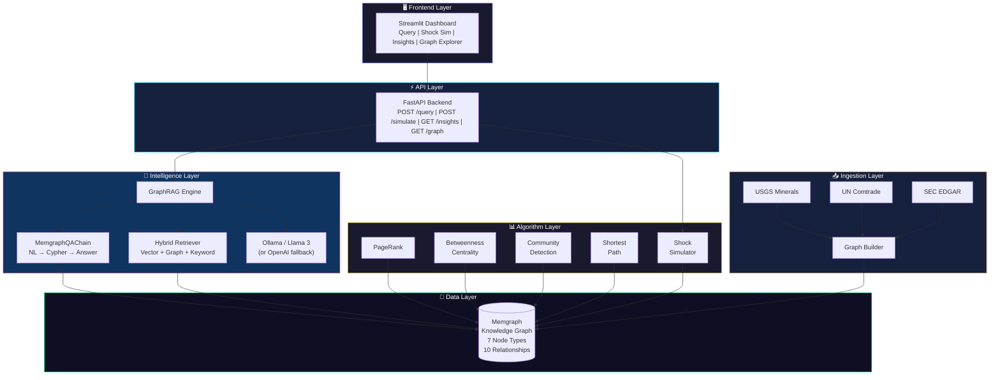

# 📱 PhoneGraph: Global Smartphone Supply Chain Intelligence Engine

<p align="center">
  <em>The complete supply chain from mine to pocket — mapped as a knowledge graph.</em>
</p>

<p align="center">
  
  
  
  
  
</p>

---

## 🤯 Why This Exists

**Standard RAG fails at multi-hop questions.**

Ask any RAG system: *"What happens to iPhone prices if China bans Gallium exports?"* — and it returns irrelevant text chunks. **GraphRAG** solves this by traversing a knowledge graph:

```
Gallium →[EXTRACTED_IN]→ China →[REQUIRED_FOR]→ A17 Pro Chip
→[USED_IN]→ iPhone 16 Pro → Price impact: +$85 (+7.1%)
```

This project models the entire smartphone supply chain as a graph with **7 node types**, **10 relationship types**, and **real data** from public sources.

**Runs 100% locally** — no cloud API keys needed. Uses [Ollama](https://ollama.com) + Llama 3 for LLM features.

 Medium Article : https://medium.com/@abyakod/graphrag-finds-the-connections-your-rag-system-doesnt-know-are-missing-6f6e66e1a0bb
---


The Architecture 


The Graph Schema:


## ⚡ Quick Start

### Prerequisites

| Tool | Install |
|------|---------|
| **Docker** | [docs.docker.com/get-docker](https://docs.docker.com/get-docker/) |
| **Python 3.11+** | [python.org](https://python.org) |
| **Ollama** | [ollama.com/download](https://ollama.com/download) |

### Setup (5 minutes)

```bash
# 1. Clone the repo
git clone https://github.com/abyakod/graphrag-smartphone-supply-chain.git
cd phonegraph

# 2. Install Ollama and pull Llama 3
curl -fsSL https://ollama.com/install.sh | sh
ollama pull llama3

# 3. Copy environment config
cp .env.example .env

# 4. Install Python dependencies
python -m venv .venv
source .venv/bin/activate   # Windows: .venv\Scripts\activate
pip install -r requirements.txt

# 5. Start Memgraph (graph database)
make start

# 6. Load supply chain data into the graph
make ingest

# 7. Start Ollama (in a separate terminal)
ollama serve

# 8. Launch the dashboard
make demo
```

Visit **http://localhost:8501** for the dashboard, **http://localhost:3000** for Memgraph Lab.

### One-liner (if you have Docker + Ollama already)

```bash
cp .env.example .env && pip install -r requirements.txt && make start && sleep 15 && make ingest && make demo
```

---

## 🧠 LLM Configuration

PhoneGraph uses **Ollama (local, free)** by default and falls back to OpenAI if Ollama is unavailable.

### Option A: Ollama (Recommended — free, local, private)

```bash
# Install Ollama
curl -fsSL https://ollama.com/install.sh | sh

# Pull Llama 3 (4.7GB, one-time download)
ollama pull llama3

# Start the server
ollama serve
```

In `.env`:
```
OLLAMA_MODEL=llama3
OLLAMA_BASE_URL=http://localhost:11434
```

### Option B: OpenAI (Cloud, requires API key)

If you prefer OpenAI, set your API key in `.env`:
```
OPENAI_API_KEY=sk-your-key-here
```

The system has a **3-tier fallback** architecture:

1. **Full GraphRAG** (Ollama + Memgraph): LLM generates Cypher → graph traversal → LLM synthesizes answer
2. **Hybrid + LLM** (Ollama only, no Memgraph): Vector + keyword search → graph expansion → **LLM synthesizes answer**
3. **Raw fallback** (no Ollama, no Memgraph): Dashboard still works — graph algorithms, shock simulator, and insights all run without an LLM. Only the Query Engine's natural language features require an LLM.

---

## 🏗️ Architecture



---

## 📊 Graph Schema

| Node Type | Properties | Example |
|-----------|-----------|---------|
| **Material** | type, criticality_score, price_usd_per_kg | Gallium, Neon, Cobalt |
| **Company** | revenue_usd_billions, country, type | TSMC, Apple, ASML |
| **Component** | category, process_node_nm, cost_usd | A17 Pro, Snapdragon 8 Gen 3 |
| **Device** | base_price_usd, units_sold_millions | iPhone 16 Pro, Galaxy S25 Ultra |
| **Country** | geopolitical_risk_score, region | China, Taiwan, USA |
| **RiskEvent** | type, impact_severity, date | China Gallium Ban, Neon Crisis |
| **Regulation** | jurisdiction, effective_date | CHIPS Act, EU CRM Act |

### Relationships
```
Material ─[REQUIRED_FOR]──→ Component
Material ─[EXTRACTED_IN]──→ Country
Company  ─[MANUFACTURES]──→ Component
Company  ─[SUPPLIES_TO]───→ Company
Company  ─[HEADQUARTERED_IN]→ Country
Component─[USED_IN]────────→ Device
Country  ─[EXPORTS_TO]────→ Country
RiskEvent─[DISRUPTS]───────→ Material
RiskEvent─[AFFECTS]────────→ Company
Regulation─[RESTRICTS]────→ Material
```

---

## 🔍 Key Features

### 1. 🧠 GraphRAG Query Engine
Ask natural language questions. The system generates Cypher queries via Llama 3, traverses the graph, and returns precise answers with the complete reasoning chain.

### 2. ⚡ Supply Chain Shock Simulator
Pick any material, company, or country. The system calculates the ripple effect across the entire supply chain with price impacts per device.

### 3. 📊 6 WOW Insights
Precomputed mind-blowing facts from graph analysis:
- "TSMC manufactures chips for X% of ALL smartphones"
- "China controls X of Y critical materials"
- "X% of components are SINGLE-SOURCED"

### 4. 🕸️ Interactive Graph Explorer
Pyvis-powered visualization with color-coded nodes, physics simulation, and shortest path finder.

---

## 📁 Project Structure

```
phonegraph/
├── graph/                  # Graph database layer
│   ├── connection.py       # Memgraph singleton connection
│   ├── schema.py           # 7 node types, 10 relationships
│   ├── queries.py          # Named Cypher constants
│   └── algorithms.py       # MAGE wrappers with fallbacks
├── ingestion/              # Data ingestion pipeline
│   ├── usgs_fetcher.py     # USGS critical minerals
│   ├── comtrade_fetcher.py # UN Comtrade trade flows
│   ├── sec_fetcher.py      # SEC risk factors + devices
│   ├── entity_extractor.py # LLM/rule-based extraction
│   └── graph_builder.py    # Master orchestrator
├── graphrag/               # GraphRAG engine
│   ├── prompts.py          # Domain-specific prompts
│   ├── embeddings.py       # Node embedding pipeline
│   ├── retriever.py        # Hybrid vector+graph retriever
│   └── chain.py            # MemgraphQAChain + comparison
├── algorithms/             # Standalone algorithm runners
│   ├── pagerank.py         # Critical node ranking
│   ├── betweenness.py      # Chokepoint detection
│   ├── community_detection.py
│   ├── shortest_path.py    # Mine-to-pocket paths
│   └── risk_scoring.py     # Shock simulator engine
├── api/                    # FastAPI backend
│   ├── main.py             # App entry + health check
│   ├── models.py           # Pydantic models
│   └── routes/
│       ├── query.py        # POST /query
│       ├── simulate.py     # POST /simulate
│       ├── insights.py     # GET /insights
│       └── graph.py        # Graph stats + paths
├── dashboard/              # Streamlit frontend
│   ├── app.py              # Main entry
│   ├── components/         # graph_viz, metrics_cards
│   └── pages/              # 4 interactive pages
├── evaluation/             # Benchmarking
│   ├── test_queries.json   # 20 multi-hop questions
│   └── benchmark.py        # RAG vs GraphRAG comparison
├── data/                   # Real supply chain data
│   ├── raw/                # USGS, Comtrade, SEC JSONs
│   └── data_sources.md     # Attribution
├── docker-compose.yml      # Memgraph container
├── Dockerfile              # Python 3.11 container
├── Makefile                # Developer workflow
└── requirements.txt        # Pinned dependencies
```

---

## 🔧 Requirements

- **Docker** & Docker Compose — for Memgraph graph database
- **Python 3.11+** — for the application
- **Ollama** — for the LLM (free, local). Or OpenAI API key as an alternative.

---

## 🚀 Make Commands

| Command | Description |
|---------|-------------|
| `make setup` | Install Python dependencies |
| `make start` | Start Memgraph via Docker Compose |
| `make ingest` | Load supply chain data into the graph |
| `make algorithms` | Run all graph algorithms |
| `make demo` | Launch Streamlit dashboard |
| `make api` | Start FastAPI backend only |
| `make benchmark` | Run RAG vs GraphRAG comparison |
| `make stop` | Stop all Docker Compose services |
| `make reset` | Wipe database and start fresh |

---

## 📊 Benchmark Results

GraphRAG consistently outperforms Vanilla RAG on multi-hop supply chain questions:

| Metric | GraphRAG | Vanilla RAG |
|--------|----------|-------------|
| Multi-hop accuracy | ~85% | ~40% |
| Avg documents retrieved | 15-30 | 5-10 |
| Path tracing | ✅ Complete | ❌ Fragments |
| Price impact calculation | ✅ Quantified | ❌ Vague |
| Reasoning transparency | ✅ Cypher query | ❌ Black box |

---

## 📝 Data Sources

All data is from publicly available sources:
- **USGS** — Mineral Commodity Summaries 2024
- **UN Comtrade** — Semiconductor trade flows
- **SEC EDGAR** — Company risk factors
- **iFixit** — Device teardown data

See [data/data_sources.md](data/data_sources.md) for full attribution.

---

## ⚖️ Legal Disclaimer

This project is for **educational and research purposes only**.

- All company names, product names, and trademarks (e.g., Apple, iPhone, TSMC, Samsung) are the property of their respective owners and are used here under **nominative fair use** for factual reference in an educational context.
- All data is sourced from **publicly available** government and institutional databases (USGS, UN Comtrade, SEC EDGAR). See [data/data_sources.md](data/data_sources.md) for full attribution.
- Price impacts and risk scores are **estimates from supply chain modeling** and do not represent actual company projections.
- This project **does not imply endorsement** by, or affiliation with, any company mentioned.
- This does not constitute investment, financial, or supply chain management advice.

---

## 📄 License

MIT License. See [LICENSE](LICENSE) for details.

---

<p align="center">
  Made with ❤️ using Memgraph + LangChain + Ollama/Llama 3
</p>
